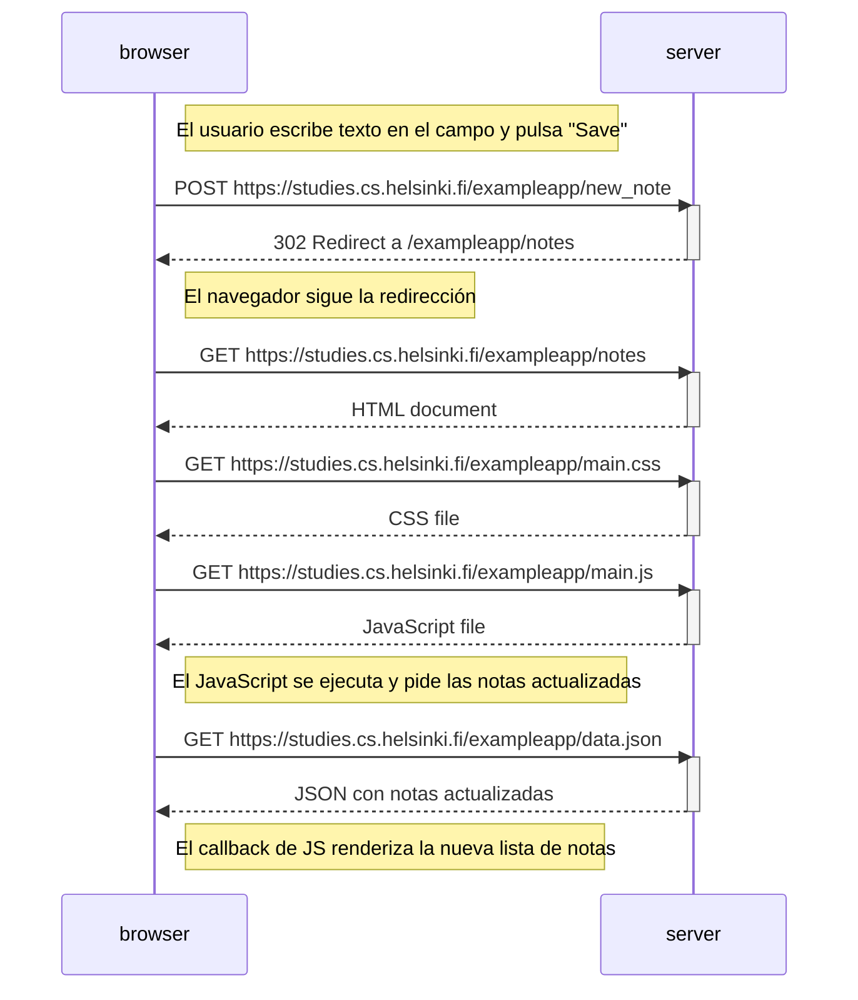

```mermaid
sequenceDiagram
    participant browser
    participant server

    Note right of browser: El usuario escribe texto en el campo y pulsa "Save"

    browser->>server: POST https://studies.cs.helsinki.fi/exampleapp/new_note
    activate server
    server-->>browser: 302 Redirect a /exampleapp/notes
    deactivate server

    Note right of browser: El navegador sigue la redirección

    browser->>server: GET https://studies.cs.helsinki.fi/exampleapp/notes
    activate server
    server-->>browser: HTML document
    deactivate server

    browser->>server: GET https://studies.cs.helsinki.fi/exampleapp/main.css
    activate server
    server-->>browser: CSS file
    deactivate server

    browser->>server: GET https://studies.cs.helsinki.fi/exampleapp/main.js
    activate server
    server-->>browser: JavaScript file
    deactivate server

    Note right of browser: El JavaScript se ejecuta y pide las notas actualizadas

    browser->>server: GET https://studies.cs.helsinki.fi/exampleapp/data.json
    activate server
    server-->>browser: JSON con notas actualizadas
    deactivate server

    Note right of browser: El callback de JS renderiza la nueva lista de notas
```
