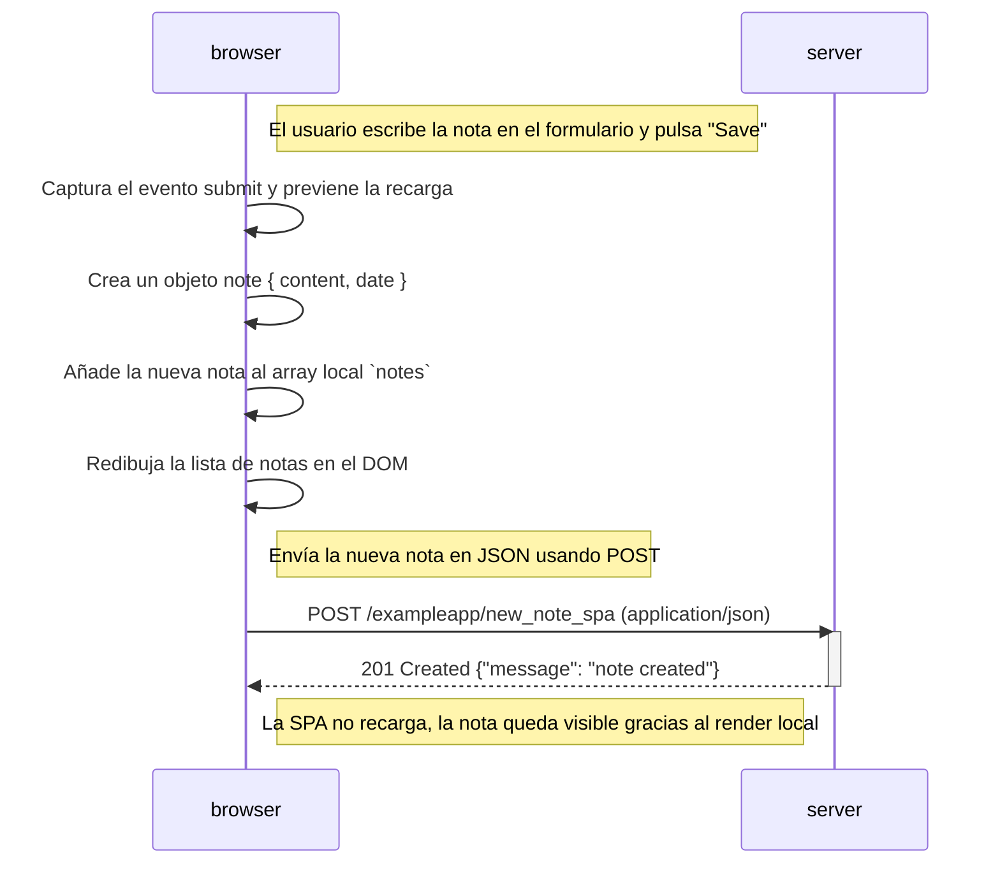

```mermaid

sequenceDiagram
    participant browser
    participant server

    Note right of browser: El usuario escribe la nota en el formulario y pulsa "Save"

    browser->>browser: Captura el evento submit y previene la recarga
    browser->>browser: Crea un objeto note { content, date }
    browser->>browser: Añade la nueva nota al array local `notes`
    browser->>browser: Redibuja la lista de notas en el DOM

    Note right of browser: Envía la nueva nota en JSON usando POST
    browser->>server: POST /exampleapp/new_note_spa (application/json)
    activate server
    server-->>browser: 201 Created {"message": "note created"}
    deactivate server

    Note right of browser: La SPA no recarga, la nota queda visible gracias al render local

```
